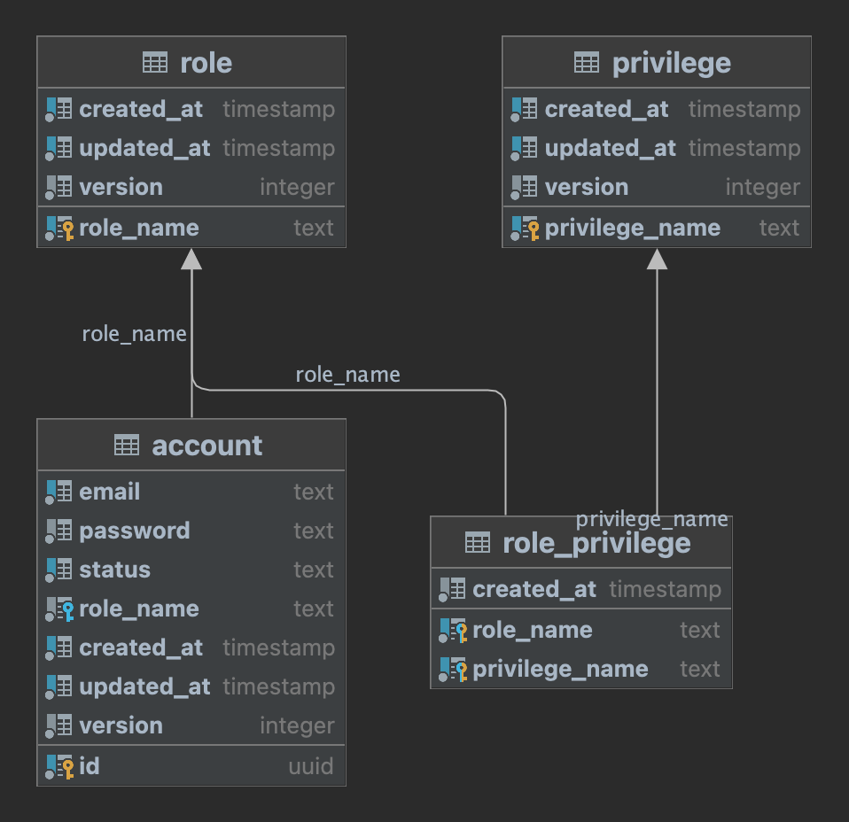

# role-permission
`role-permission` is a practical assessment for the Senior Backend Developer position. The application is built using 
Spring Boot API that implements a role & permission system. This system should allow each user to have a specific role and restrict access to certain APIs based on these roles and permissions.

## Prerequisites

### Methodology

- **Domain Driven Design (DDD)**: main principle to separate different business concerns into their clear bounded contexts.
- **Hexagonal Architecture**: the approach used to separate the business concerns & technical concerns within a specific bounded context.

### Technology stack

- OpenJDK 21
- Spring Boot 3.2.4
- Gradle 8.7
- Docker Desktop 4.27.1
- PostgreSql 15.3
- Junit 4.13.2

## Getting Started

### Provision the database

- For your convenience, we provide a [docker-compose.yml](docker-compose.yml) file to provision the Postgresql database. Please take note the information used in this file because they are also configured accordingly in [application.yml](src/main/resources/application.yml) file to run this project.

- Provision command:

```shell script
$ docker-compose -f docker-compose.yml up -d

...

Container postgres_role_permission  Started
```

### Build the role-permission application

```shell script
$ ./gradlew clean build

...

org.ovida.auth.JpaSuiteTest > org.ovida.auth.app.StdAccountAppSvc_IT.shouldReturnCorrectResults_WhenSearch(1, 10, 12, 2, [00000000-0000-0000-0000-000000000002, 00000000-0000-0000-0000-000000000001]) [1] PASSED

org.ovida.auth.JpaSuiteTest > org.ovida.auth.app.StdAccountAppSvc_IT.shouldReturnCorrectResults_WhenSearch(2, 10, 12, 0, []) [2] PASSED

BUILD SUCCESSFUL in 8s
8 actionable tasks: 8 executed

```

- Please note that the integration tests defined under the [test](src/test) directory are also executed as part of the build process. Under the hood, the integration tests are using the `testcontainers` library to spin up a Postgresql container to run the tests & then tear down the container after the tests are completed. You can also run the tests individually in your favorite IDE. However, you need to spin up the Postgresql container manually using the provided [docker-compose.yml](docker-compose.yml) file.

- The [StdTokenAppSvc](src/main/java/org/ovida/auth/app/token/StdTokenAppSvc.java) class is added for API testing purposes. It is a simple API that generates a JWT token based on the user credentials & roles. Therefore, it is not part of the test suite.

### Run the role-permission application

```shell script
$ java -jar ./build/libs/role-permission-0.0.1.jar

...

2024-08-11T18:10:59.883Z INFO  [ role-permission - main ] o.s.b.w.e.t.TomcatWebServer(241): - Tomcat started on port 8080 (http) with context path ''
2024-08-11T18:10:59.891Z INFO  [ role-permission - main ] o.s.b.StartupInfoLogger(56): - Started Application in 3.062 seconds (process running for 3.641)
```

### Initialize schemas & seed data

- `Flyway` is used to initialize the database schema automatically when the role-permission application first bootstrap. You will see a `flyway_schema_history` table to track the schema version in the default `pubic` schema of Postgresql. The schema file & the seed data locate at [migration](src/main/resources/db/migration) directory.

- The seed data includes the following:
  - 2 roles: `Admin` & `Member`
  - 2 privileges: `READ_ACCOUNT`, `WRITE_ROLE`
  - 2 accounts: `admin@admin.com` & `member@member.com`
  - 2 role privileges: `Admin` with `READ_ACCOUNT` & `WRITE_ROLE` privileges

### ERD Diagram



### Play with the role-permission application APIs

- Please import the [role-permission Postman collection](role-permission.postman_collection.json) to your Postman application to test the APIs.